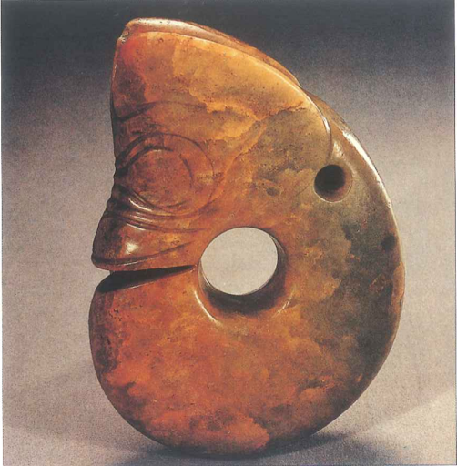
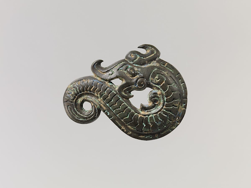

---
output:
  pdf_document: default
  html_document: default
---

# Dragon Art in Ancient China {-#ancient}

---

{width=60%}

[(c. 3500 BC., Hongshan Culture, Neolithic period). Pig-Dragon Ring; Jade. The National Museum of China, Beijing, China.]()

Discovered at Sanguan Dianzi in Liaoning province, from the Neolithic  Hongshan Culture，this jade *Pig-Dragon* ornament (pictured above) is one of the first representations of the Dragon figure that we see in Chinese art history. Neolithic cultures usually derived their art inspiration from nature itself as these cultures did not have a concrete sense of religion, nor understand the concept of longevity that was later attached to the dragon. This type of artifact was found buried in stone ritual structures, indicating that it was mostly likely used in a ritualistic setting (Ebrey). 
 
It is called a *Pig-Dragon* because the form of the snout is very similiar to that of a pig. This dragon also exhibits a relatively long body that characterizes the Chinese dragon, and yet it is in a ring shape. In order to create this ring shape, neolithic villagers had to polish it with sand for days.

{width=75%}

[(13th–11th century B.C., Shang Dynasty). Appliqué in the Form of a Dragon, Bronze. The Metropolitan Museum of Art, New York, United States.](https://www.metmuseum.org/art/collection/search/49505){target="_blank"}

This second sculpture, *Bronze Applique in the Form of a Dragon*, is a small representation of the big detailed bronze artifacts common to the Shang Dynasty. Despite its rather small size of 6.8 cm in length, the applique itself still has many details. The most noticeable detail is its similarity to the Neolithic *Pig-Dragon*, to which it shares the pig snout design. The detailing also expresses common characteristic of the Chinese dragon such as the long body with scales, short arms, and horns.

During the Shang dynasty, dragon figures was overshadowed by the mystical figure of the *taotie* (Kesner). Thus, these two figures are even more special, as they are one of the few existing and complete images of how the dragon was envisioned during this time. In general, the dragon was usually used as a small collide decoration symbol in many of the Shang bronze vessels, and later became a popular symbol for ceremonial ritual vessels (Kesner). However, its significance as a ritual decoration did not render its size to be comparable to the *taotie*, since it was still crafted in small sizes. 

