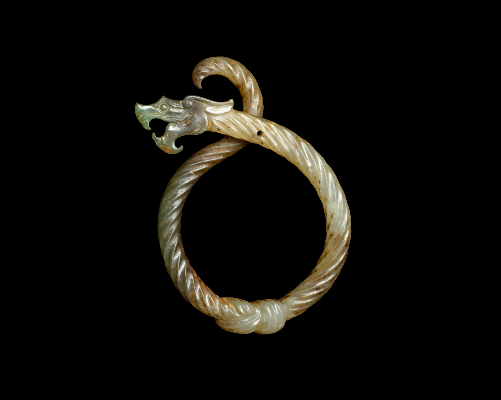
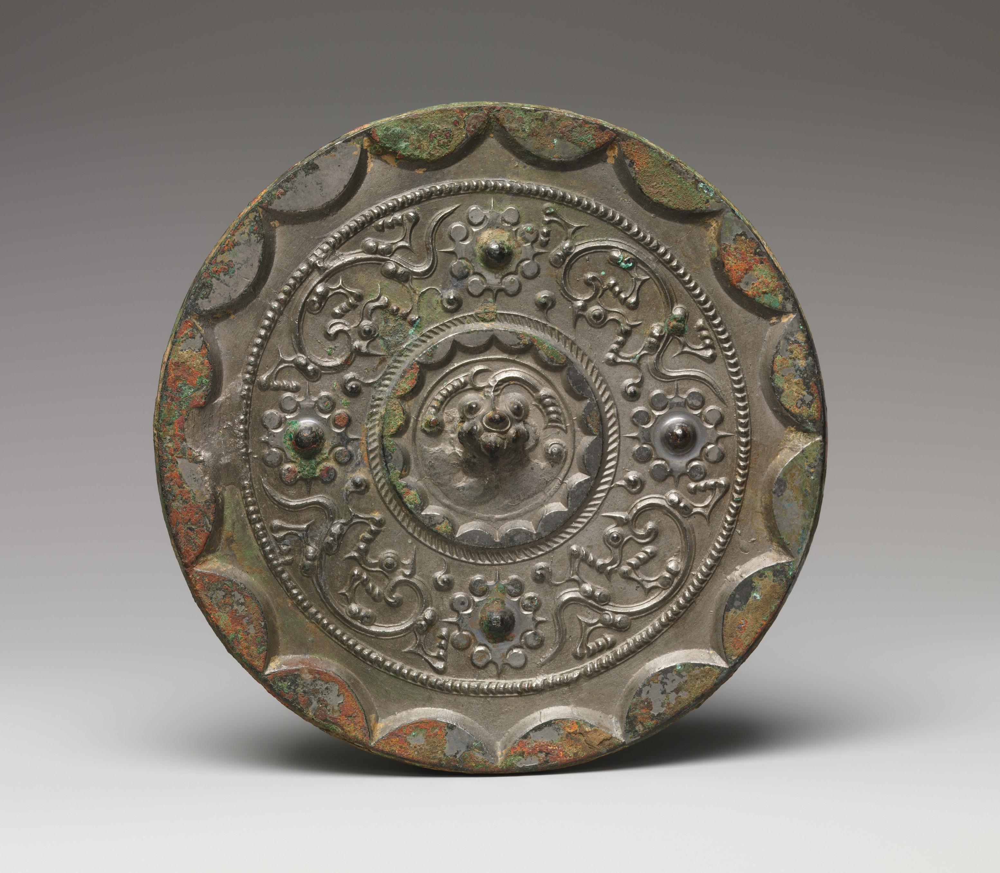

---
output:
  pdf_document: default
  html_document: default
---

# Rise of Dragon sculptures as luxury items {-#zhou_han}

---

{width=50%}

[(3rd century BC, Eastern Zhou Dynasty, Warring States period). Knotted Dragon Pendant, Jade (nephrite). The Metropolitan Museum, New York.](https://www.metmuseum.org/art/collection/search/39637){target="_blank"}

The Knotted Dragon Pendant artifact is from the Eastern Zhou dynasty during the Warring States period (475-221BC). It is made of jade or nephrite, and the dimensions are 7.9 cm in height and 5.2 cm in width. The Metropolitan Museum of Art in New York first exhibited this artifact in the 2005 “Arts of Ancient China” exhibition. It was donated by the Ernest Erickson Foundation in 1985. According to the museum, the exquisite detailing of the dragon head shape with a twisted rope body design on the pendant using jade, which is hard to handle, shows the advanced technique of the Zhou Dynasty jade carvers.

During the Eastern Zhou time, the dragon had less of a ritual and auspicious significance than the previous dynasties. The function of the dragon decoration was more for an indication of luxury. The detailed features of the dragon were achieved by highly advanced carvers therefore, only people with status and of royal descent could have these designs.

The Mirror with Nipple and Dragon Design artifact is from the Western Han Dynasty (206 BC-AD 9). It is made of bronze with a dimension of approximately 15.6cm in diameter. The artifact was exhibited at the Metropolitan Museum of Art in New York and was purchased from Elizabeth V Cockcroft in 2008.
      
The Han Dynasty believed the dragon design had an auspicious meaning. The dragon was believed to be a mythical creature that acted as a guardian to mortals. This mirror from the Western Han dynasty may be a precursor to the TLV mirrors in later Han that would be used to ward off evil and protect the person who carried the mirror. The dragon is one of the four mythical creatures that people believed held immense immortal powers. The Han Emperor would therefore create stories of encountering dragons on their quest for immortality to legitimize their claim to the throne.

{width=75%}

[(206 BC – AD 9, Western Han Dynasty). Mirror with Nipple and Dragon Design, Bronze. The Metropolitan Museum, New York.](https://www.metmuseum.org/art/collection/search/74429){target="_blank"}

