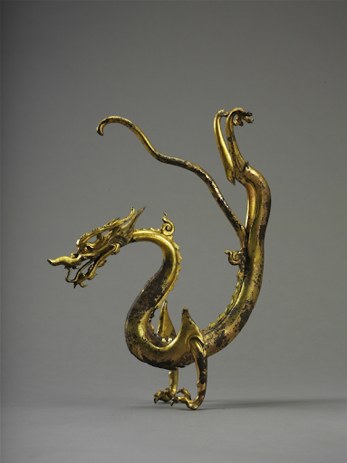
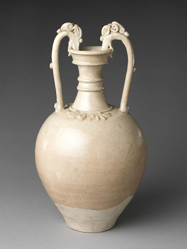

---
output:
  pdf_document: default
  html_document: default
---
# Silk Road Influences {-#tang}

---

{height=70%}

[(Tang Dynasty). Mirror with Dragon, Bronze with Iron Core. Shaanxi History Museum, Xi’an.]()

This item has toured the world several times, but is usually displayed in the Shaanxi Museum, which is closest to its area of discovery. This dragon seems to be a part from a larger luxury item belonging to the Tang period (8th Century AD). It is made from bronze with an iron core. This object provides a clear example of the stylistic changes that the dragon underwent in this period: Unlike previous dynasties, dragons in the Tang period start to take on a distinctive serpentine style, with longer tails and flowing forms that seem to be flying. This use of a dragon in a new artistic context is standard for many motifs in the Tang period, which was heavily influenced by the influence of the Silk Road. This trend of mixing the dragon with new artistic ideas, especially with new religious imagery, continues heavily into later dynasties. 

{}

[(c. 7th century AD)., Tang Dynasty. Jar with Dragon-Headed Handles, Stoneware. The Metropolitan Museum, New York.](https://www.metmuseum.org/art/collection/search/45862){target="_blank"}

This stoneware jar (7th Century AD) is currently housed in the Metropolitan Museum of New York. Without the dragon handles, on first glance the jar does not seem strikingly “Chinese” in style. In fact, many of the stylistic elements (from the color, to the shape, to the floral decorations) seem to be Greco-Roman in nature. This makes this item a unique piece through which to consider the influx of artistic ideas during the Tang period. It is likely that, with the Silk Road encouraging exchange from China to the West, artistic designs would have easily spread during this period. The dragon handles have a sort of flowing design, similar to the first piece, that come to define Chinese dragons in this period. 
	
