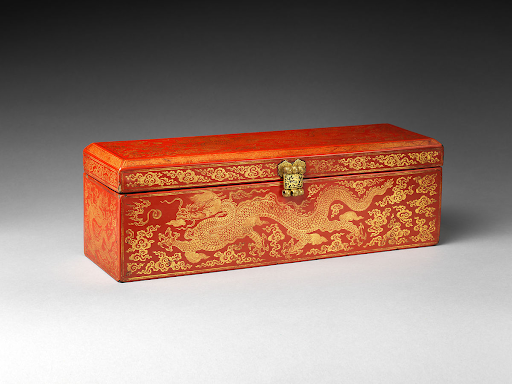
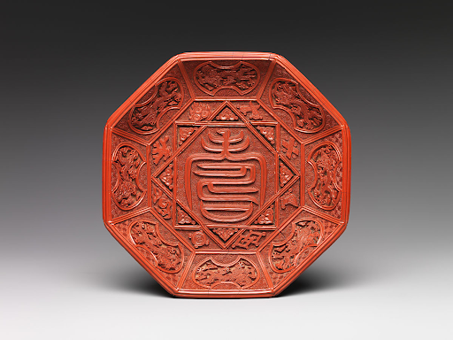

---
output:
  pdf_document: default
  html_document: default
---

# Dragons as Political Symbols  {-#ming}

---

## The Ming Lacquer Sutra Box {-}

{width=80%}

[(1403-1424, Ming Dynasty Yongle Period). Sutra box with dragons amid clouds; Lacquer with gold inlay and brass. The Metropolitan Museum,New York.](https://www.metmuseum.org/art/collection/search/60870){target="_blank"}

This is a wooden sutra box dated to the Yongle period of the Ming Dynasty (1403-1424) likely made in an imperial workshop. It is decorated with red lacquer, gold inlay and brass lock/hinges which depict five clawed dragons amid clouds. Dimensions are H. 5 1/2 in. (14 cm); W. 5 in. (12.7 cm); L. 16 in. (40.6 cm). Located in the New York Metropolitan Museum of Art. Museum Description [Vigorous, sinewy dragons are frequently depicted on works produced during the reign of the Yongle emperor. This luxurious box, made to hold a sutra in the Chinese album format, was created for use at court].
This lacquerware sutra box was created for use in the Yongle emperor’s court. It can be seen that the dragons depicted on this piece have five claws indicating that this was created for the explicit purpose of being used by the emperor himself or by members of his court. While the specific association of the emperor to five-clawed dragons only came about in the Yuan dynasty, the more general association of the emperor to dragons can be traced to Liu Bang who founded the Han dynasty and claimed descent from a dragon.

In addition to its political symbolism this dragon also maintains religious significance. Dragons have been used as an auspicious symbol in Chinese art for millenia. However, this particular usage of a dragon in Buddhist art can be seen as a continuation of the Song dynasty’s use of existing Chinese symbols in place of more traditional Indian symbols.

## The Ming Lacquer Dish with Dragons {-}

{width=70%}

[(c. 1522-1566, Ming Dynasty Jiajing period). Dish with character for longevity (shou); Lacquer. The Metropolitan Museum, New York.](https://www.metmuseum.org/art/collection/search/60870){target="_blank"}

This is a lacquer ware dish from the Jiajing period of the Ming Dynasty (1522-1566). It is decorated with auspicious symbols such as dragons and the character for longevity (壽, shou). Dimensions are H. 1 5/16 in. (3.3 cm); Diam. 6 /4 in. (17.1 cm). Located in the New York Metropolitan Museum of Art. Museum Description [Eight auspicious emblems, including flaming pearls, a pair of horns, and a pair of books, encircle the character for longevity (shou) in the center of this dish; the same designs are found on the exterior. The dragons on the outer edge all lack one claw. Since five-clawed dragons symbolized the emperor, the claws were likely removed to make the dish suitable for presentation to a member of the nobility or a senior court official].

This lacquerware from the Jiajing emperor’s rule illustrates the dragon’s symbolic association with the concept of longevity which stands as a Daoist ideal. This can be seen in its placement alongside other auspicious symbols such as the stylized shou (壽) character which often appears in Daoist artworks due to its meaning of longevity and flaming pearls which often represent immortality and vitality.

This piece also shows the continued symbolic association between dragons and imperial power, particularly the usage of five-clawed dragons to represent the emperor himself. The presence of these symbols indicates that this was crafted for the use of the emperor or his court. However, the exclusive nature of this symbol can also be seen in the fact that each dragon has the fifth claw filed down in order to allow its possession by a noble outside of the imperial court.

