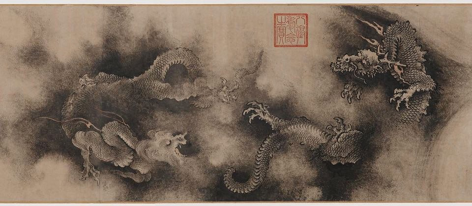

--- 
title: "Dragons Throughout Chinese Arts"
author: "Dragon team"
date: "`December 18, 2020`"
site: bookdown::bookdown_site
documentclass: book
bibliography: [book.bib, packages.bib]
biblio-style: apalike
link-citations: true 
indent: true
description: "This is the online pamplet to an exhibition of dragons in Chinese art. This is part of a final curation project for History of Chinese Art at NYU Shanghai Fall 2020."
github-repo: sc6354/hoca_final_project_exhibition_pamphlet
favicon: images/favicon.ico
cover-image: images/cover.png
url: https://sc6354.github.io/hoca_final_project_exhibition_pamphlet/

---

# Motivation {-}


The **bookdown** package can be installed from CRAN or Github:


Remember each Rmd file contains one and only one chapter, and a chapter is defined by the first-level heading `#`.

To compile this example to PDF, you need XeLaTeX. You are recommended to install TinyTeX (which includes XeLaTeX): <https://yihui.org/tinytex/>.

```{r include=FALSE}
# automatically create a bib database for R packages
knitr::write_bib(c(
  .packages(), 'bookdown', 'knitr', 'rmarkdown'
), 'packages.bib')
```

<!--chapter:end:index.Rmd-->

# Introduction {-#intro}


<!--chapter:end:01-Intro.Rmd-->

# Dragon Art in Ancient China {-#ancient}

Discovered at Sanguan Dianzi in Liaoning province, from the Neolithic  Hongshan Culture，this jade “Pig-Dragon” ornament is one of the first representations of the Dragon figure that we see in Chinese art culture. Neolithic cultures usually derived their art inspiration from nature itself, they still did not have a concrete sense of religion, nor the concept of longevity attached to the dragon. This type of artifact was found buried in stone ritual structures, giving them a ritualistic meaning (Ebrey). 
 Called a “Pig- Dragon” because of the similar form of the snout to that of a pig. This Dragon also has a long body characterized by a Chinese Dragon, yet it is in a  ring shape. To give this piece of jade this ring dragon shape neolithic villagers most had used sand and days to polish. 


<center>

{width=100%}

[(c. 3500 BC., Hongshan Culture, Neolithic period). Pig-Dragon Ring; Jade. The National Museum of China, Beijing, China.]()
</center>


This small bronze applique in the form of a dragon is a small representation of the big detailed bronze artifacts common to the Shang Dynasty. Yet this 6.8 cm in length applique itself has many details. The first detail will be the similarity to the Neolithic Pig- Dragon, due to the similarity of the snout to that of a pig. The detailing also expressed the common characteristic in Chinese Dragon of a long body with scales, short arms, and horns. During the Shang dynasty the dragon figure was overshadowed by the mystical figure of the taotie (Kesner). So this figure is really special, as we can have a complete image of how the dragon was vision during this time. The Dragon usually was used as a small collide decoration symbol in many of the Shang bronze vessels, later it became a popular symbol for ceremonial ritual vessels (Kesner). Yet still it still was crafted in a smaller version than that of the taotie. 

<center>

{width=100%}

[(13th–11th century B.C., Shang Dynasty). Appliqué in the Form of a Dragon, Bronze. The Metropolitan Museum of Art, New York, United States.](https://www.metmuseum.org/art/collection/search/49505)
</center>


<!--chapter:end:02-ancient.Rmd-->

# Artifact 3 {-#artifact3}

We describe our methods in this chapter.

<!--chapter:end:03-han.Rmd-->

# Artifact 4 {-#artifact4}

Some _significant_ applications are demonstrated in this chapter.

## Example one

## Example two

<!--chapter:end:04-tang.Rmd-->

---
output:
  pdf_document: default
  html_document: default
---
# Dragon Paintings in the Song and Yuan Dynasties {-#Dragon_Paintings}

---

## The emergence of Dragon paintings in the Song Dynasty {-}

During the Song dynasty, dragon paintings emerged as an independent painting genre. As a result, Chinese artists were given more room to experiment with styles, techniques, and compositions that they felt would best capture the likeness and spirit of the imaginary creature (Tseng). Simultaneously, ideas about the representation of the supernatural (including dragons) regained discussion as scholars pointed out that the form of the supernatural could be easily fabricated since they are not fully visible (Wenyuange). Nonetheless, the composition and form of the dragon developed during the Song Dynasty are closest to what is now generally regarded as the Chinese Dragon. 


<center>

{width=120%}

[Chen R., (First Half of the 13th Century). Nine Dragons; Handscroll, ink on paper. Museum of Fine Arts Boston, Massachusetts, United States.](https://collections.mfa.org/objects/28526)
</center>


Nine Dragons is a paper scroll by southern Song dynasty artist, Chen Rong, measuring 46.8 cm in height and 14996.5 cm in length. Chen Rong is widely celebrated for his depictions of dragons and this painting, in particular, is highly praised for its grandeur length and style. The monochromatic black ink painting dates back to 1244 and is currently the lengthiest surviving painted dragon scroll. It is now housed in the Museum of Fine Arts in Boston.
The painting also features running scripts and inscriptions that give details about Chen Rong’s motivations for the painting. From the inscriptions, we know that Chen Rong was inspired by two earlier paintings, namely, Nine Horses and Nine Deer. They were, respectively, created by Cao Ba (AD 704-770), a general and painter of the Tang Dynasty (AD 618-907), and Huichong, a monk and painter active in the early Northern Song Dynasty (960-1127). Not to many’s surprises, Chen Rong also painted another famous dragon handscroll called Five Dragons, but in a vertical orientation

## Dragon Paintings as Bearers of Rain {-}

Another development of dragon art as it pertains to the Song and Yuan dynasties is the conception of dragons as water. As such, dragon paintings were used in rain rituals by the state to summon rain (Purtle). In Song Shi (The History of the Song Dynasty), three accounts of state-prescribed rain rituals were recorded, two of which used dragon effigies.

Although the state had a well-defined and prescribed image of the dragon that was to be used in rain rituals as outlined in “Painted Dragon Method of Praying for Rain (畫龍祈雨法), Chen Rong’s dragon is a strong deviation from that form. Regardless, the masterpiece was highly praised for being exceptionally good at summoning rain. The greatest difference in composition is his technique of action painting. 

This technique, which is said to be most effective when Chen Rong was drunk, involves blotting, spitting, splashing, and splattering ink on the surface of the paper to create an image of rain and supernatural energy. Thus, the splattered and smeared ink became clouds, and split from the mouth became mist. In the 6th line of his poetic inscriptions, Chen Rong writes “Drunk, I spit forth painting from within (醉余吐出胸中畫)” (Purtle). But all of this to Chen Rong is largely a part of his creative process as evident in lines 32 and 34 of his inscriptions, where he underscores the ability of his painted dragons to bring rain. 

Dragon rain rituals continued into the Yuan dynasty with most paintings being either a close copy of Song dragon paintings or the same paintings but used repeatedly. One such work is Beneficent Rain by Zhang Yucai. Zhang Yucai was the thirty-eighth pope of the Zhengyi (“Orthodox Unity”) Daoist church, who lived at Mount Longhu (Dragon Tiger Mountain) in Jiangxi Province. He was often called upon by the Yuan court to commence rain and snow. Similarly, he would also perform rituals that summoned thunder and lightning to quell a sea monster. 


<center>

{width=120%}

[Zhang, Y. (C. Early 14th century) Beneficent Rain; Handscroll, ink on silk. The Metropolitan Museum of Art, New York, United States.](https://www.metmuseum.org/art/collection/search/40454)
</center>


In Beneficent Rain, Zhang Yucai borrowed heavily from Chen Rong’s Nine Dragons scroll. The repetitive style is meticulously carried out such that the exact pictorial form and composition of Zhang’s dragons are mirror-image reversals of Chen Rong’s third and Fourth Dragon. Additionally, Beneficent Rain has similar imagery of water and wetness that is used to represent the atmospheric effects of rain. Although there is no existing text connecting these two works, the fact that Zhang Yucai presumably copied parts of Nine Dragons’ inscriptions indicates that he intended to duplicate the ritual agency of the original. Unlike Chen Rong’s dragons, Zhang Yucai’s dragons are ink on silk and are housed at the Metropolitan Museum of Art in New York. 
 

<!--chapter:end:05-Song_and_Yuan_Dragon_Paintings.Rmd-->

A`r if (knitr::is_html_output()) '
# References {-}
'`

<!--chapter:end:06-ming.Rmd-->

# Artifact 7 {-#artifact7}

Some _significant_ applications are demonstrated in this chapter.

## Example one

## Example two

<!--chapter:end:07-conclusion.Rmd-->

