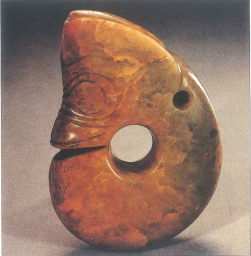
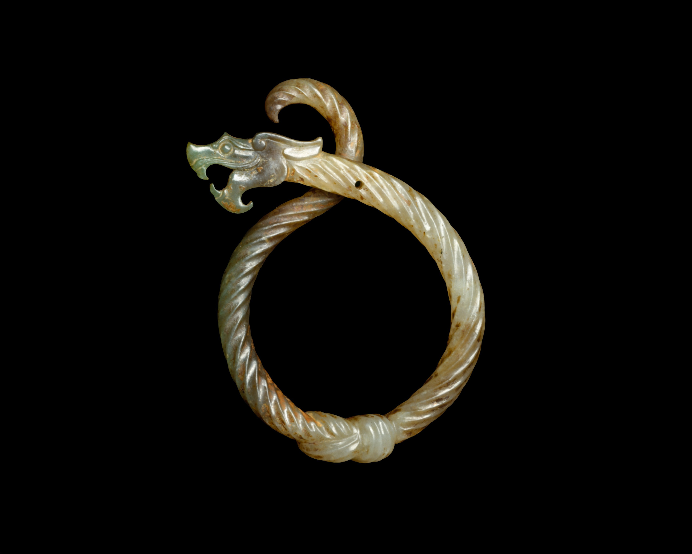
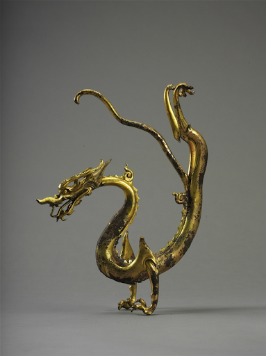
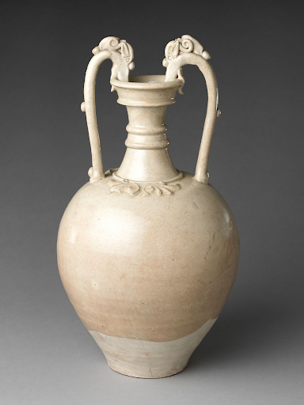
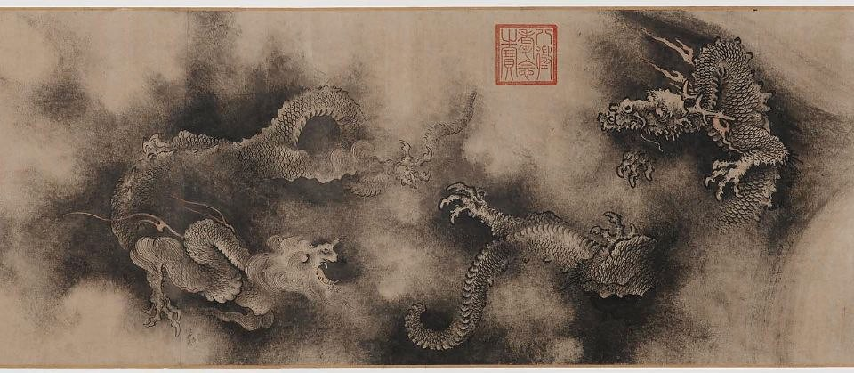
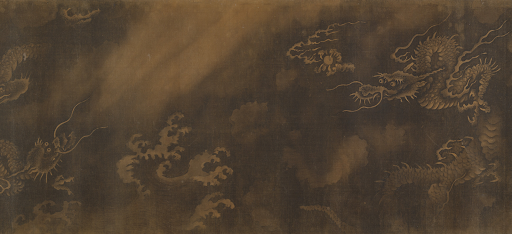
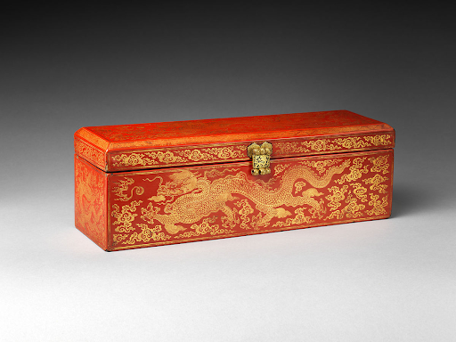
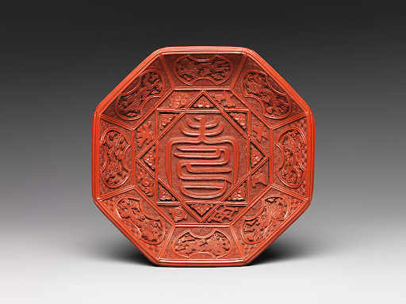

--- 
title: "The Chinese Dragon: A Lasting Evolution"
author: "by the `Dragon team`"
date: "December 14, 2020"
site: bookdown::bookdown_site
documentclass: book
bibliography: [book.bib, packages.bib]
biblio-style: apalike
link-citations: true 
indent: true
description: "This is the online pamplet to an exhibition of dragons in Chinese art. This is part of a final curation project for History of Chinese Art at NYU Shanghai Fall 2020."
github-repo: sc6354/hoca_final_project_exhibition_pamphlet
favicon: images/favicon.ico
cover-image: images/cover.png
apple-touch-icon: "images/favicon_io/apple-touch-icon.png"
apple-touch-icon-size: 120
url: https://sc6354.github.io/hoca_final_project_exhibition_pamphlet/

---

# Note to Readers {-}
We are very pleased to present this collection of ten works featuring the Chinese Dragon across dynasties and across different mediums. Some of the works in this collection have known artists, which allowed us to delved deeper into the artist technique or motivation. However, most works do not have known authors, but are still included because they are central to our narrative. 

Our goal was to curate a few dragon artwork(s) from the following time periods to offer a wholistic timeline of how the meaning and usage of dragon artworks changed and evolved through time:

1. Ancient China 
2. Zhou and Han Dynasties
3. Tang Dynasty 
4. Song and Yuan Dynasties
5. Ming and Qing Dynasties
 
Logistically, this online exhibition ran from Novemeber 20, 2020 to December 31, 2020 on the platform, artspaces.kunmatrix.com. This booklet is meant to serve as an exhibition pamplet for the accompany online exhibition. Lastly, everyone on the team would like thank Professor Lala Zuo for her support and resource recommendations. 

Sincerely, 

The Dragon Team 

- Erica Im, *Coordinator*
- Susan Chen, *Pamplet and Exhibition Designer*
- Megan Rhodes, *Writer*
- Devon Kampman, *Wrtier*
- Astrid Matute Blanco, *Writer*

<!--chapter:end:index.Rmd-->

---
output:
  pdf_document: default
  html_document: default
---

# Introduction {-#intro}

<!--chapter:end:01-Intro.Rmd-->

---
output:
  pdf_document: default
  html_document: default
---

# Dragon Art in Ancient China {-#ancient}

Discovered at Sanguan Dianzi in Liaoning province, from the Neolithic  Hongshan Culture，this jade “Pig-Dragon” ornament is one of the first representations of the Dragon figure that we see in Chinese art culture. Neolithic cultures usually derived their art inspiration from nature itself, they still did not have a concrete sense of religion, nor the concept of longevity attached to the dragon. This type of artifact was found buried in stone ritual structures, giving them a ritualistic meaning (Ebrey). 
 
It is called a “Pig-Dragon” because the form of the snout is similiar to that of a pig. This Dragon also has a long body characterized by a Chinese Dragon, yet it is in a  ring shape. To give this piece of jade this ring dragon shape neolithic villagers most had used sand and days to polish. 

{height=35%}

[(c. 3500 BC., Hongshan Culture, Neolithic period). Pig-Dragon Ring; Jade. The National Museum of China, Beijing, China.]()

This small bronze applique in the form of a dragon is a small representation of the big detailed bronze artifacts common to the Shang Dynasty. Yet this 6.8 cm in length applique itself has many details. The first detail will be the similarity to the Neolithic Pig- Dragon, due to the similarity of the snout to that of a pig. The detailing also expressed the common characteristic in Chinese Dragon of a long body with scales, short arms, and horns.

During the Shang dynasty the dragon figure was overshadowed by the mystical figure of the taotie (Kesner). So this figure is really special, as we can have a complete image of how the dragon was vision during this time. The Dragon usually was used as a small collide decoration symbol in many of the Shang bronze vessels, later it became a popular symbol for ceremonial ritual vessels (Kesner). Yet still it still was crafted in a smaller version than that of the taotie. 

{width=100%}

[(13th–11th century B.C., Shang Dynasty). Appliqué in the Form of a Dragon, Bronze. The Metropolitan Museum of Art, New York, United States.](https://www.metmuseum.org/art/collection/search/49505)

<!--chapter:end:02-ancient.Rmd-->

---
output:
  pdf_document: default
  html_document: default
---
# Rise of Dragon sculptures as luxury items {-#zhou_han}

[(3rd century BC, Eastern Zhou Dynasty, Warring States period). Knotted Dragon Pendant, Jade (nephrite). The Metropolitan Museum, New York.](https://www.metmuseum.org/art/collection/search/39637)

The Knotted Dragon Pendant artifact is from the Eastern Zhou dynasty during the Warring States period (475-221BC). It is made of jade or nephrite, and the dimensions are 7.9 cm in height and 5.2 cm in width. The Metropolitan Museum of Art in New York first exhibited this artifact in the 2005 “Arts of Ancient China” exhibition. It was donated by the Ernest Erickson Foundation in 1985. According to the museum, the exquisite detailing of the dragon head shape with a twisted rope body design on the pendant using jade, which is hard to handle, shows the advanced technique of the Zhou Dynasty jade carvers.

During the Eastern Zhou time, the dragon had less of a ritual and auspicious significance than the previous dynasties. The function of the dragon decoration was more for an indication of luxury. The detailed features of the dragon were achieved by highly advanced carvers therefore, only people with status and of royal descent could have these designs.

The Mirror with Nipple and Dragon Design artifact is from the Western Han Dynasty (206 BC-AD 9). It is made of bronze with a dimension of approximately 15.6cm in diameter. The artifact was exhibited at the Metropolitan Museum of Art in New York and was purchased from Elizabeth V Cockcroft in 2008.
      
The Han Dynasty believed the dragon design had an auspicious meaning. The dragon was believed to be a mythical creature that acted as a guardian to mortals. This mirror from the Western Han dynasty may be a precursor to the TLV mirrors in later Han that would be used to ward off evil and protect the person who carried the mirror. The dragon is one of the four mythical creatures that people believed held immense immortal powers. The Han Emperor would therefore create stories of encountering dragons on their quest for immortality to legitimize their claim to the throne.

{width=100%}

[(206 BC – AD 9, Western Han Dynasty). Mirror with Nipple and Dragon Design, Bronze. The Metropolitan Museum, New York.](https://www.metmuseum.org/art/collection/search/74429)

<!--chapter:end:03-han.Rmd-->

---
output:
  pdf_document: default
  html_document: default
---
# Silk Road Influences {-#tang}

---

{height=70%}

[(Tang Dynasty). Mirror with Dragon, Bronze with Iron Core. Shaanxi History Museum, Xi’an.]()

{}

[(c. 7th century AD)., Tang Dynasty. Jar with Dragon-Headed Handles, Stoneware. The Metropolitan Museum, New York.](https://www.metmuseum.org/art/collection/search/45862)

<!--chapter:end:04-tang.Rmd-->

---
output:
  pdf_document: default
  html_document: default
---

# Dragon Paintings in the Song and Yuan Dynasties {-#Dragon_Paintings}

## The emergence of Dragon paintings in the Song Dynasty {-}

During the Song dynasty, dragon paintings emerged as an independent painting genre. As a result, Chinese artists were given more room to experiment with styles, techniques, and compositions that they felt would best capture the likeness and spirit of the imaginary creature (Tseng). Simultaneously, ideas about the representation of the supernatural (including dragons) regained discussion as scholars pointed out that the form of the supernatural could be easily fabricated since they are not fully visible (Wenyuange). Nonetheless, the composition and form of the dragon developed during the Song Dynasty are closest to what is now generally regarded as the Chinese Dragon. 

{width=120%}

[Chen R., (First Half of the 13th Century). Nine Dragons; Handscroll, ink on paper. Museum of Fine Arts Boston, Massachusetts, United States.](https://collections.mfa.org/objects/28526)

Nine Dragons is a paper scroll by southern Song dynasty artist, Chen Rong, measuring 46.8 cm in height and 14996.5 cm in length. Chen Rong is widely celebrated for his depictions of dragons and this painting, in particular, is highly praised for its grandeur length and style. The monochromatic black ink painting dates back to 1244 and is currently the lengthiest surviving painted dragon scroll. It is now housed in the Museum of Fine Arts in Boston.
The painting also features running scripts and inscriptions that give details about Chen Rong’s motivations for the painting. From the inscriptions, we know that Chen Rong was inspired by two earlier paintings, namely, Nine Horses and Nine Deer. They were, respectively, created by Cao Ba (AD 704-770), a general and painter of the Tang Dynasty (AD 618-907), and Huichong, a monk and painter active in the early Northern Song Dynasty (960-1127). Not to many’s surprises, Chen Rong also painted another famous dragon handscroll called Five Dragons, but in a vertical orientation

## Dragon Paintings as Bearers of Rain {-}

Another development of dragon art as it pertains to the Song and Yuan dynasties is the conception of dragons as water. As such, dragon paintings were used in rain rituals by the state to summon rain (Purtle). In Song Shi (The History of the Song Dynasty), three accounts of state-prescribed rain rituals were recorded, two of which used dragon effigies.

Although the state had a well-defined and prescribed image of the dragon that was to be used in rain rituals as outlined in “Painted Dragon Method of Praying for Rain (畫龍祈雨法), Chen Rong’s dragon is a strong deviation from that form. Regardless, the masterpiece was highly praised for being exceptionally good at summoning rain. The greatest difference in composition is his technique of action painting. 

This technique, which is said to be most effective when Chen Rong was drunk, involves blotting, spitting, splashing, and splattering ink on the surface of the paper to create an image of rain and supernatural energy. Thus, the splattered and smeared ink became clouds, and split from the mouth became mist. In the 6th line of his poetic inscriptions, Chen Rong writes “Drunk, I spit forth painting from within (醉余吐出胸中畫)” (Purtle). But all of this to Chen Rong is largely a part of his creative process as evident in lines 32 and 34 of his inscriptions, where he underscores the ability of his painted dragons to bring rain. 

Dragon rain rituals continued into the Yuan dynasty with most paintings being either a close copy of Song dragon paintings or the same paintings but used repeatedly. One such work is Beneficent Rain by Zhang Yucai. Zhang Yucai was the thirty-eighth pope of the Zhengyi (“Orthodox Unity”) Daoist church, who lived at Mount Longhu (Dragon Tiger Mountain) in Jiangxi Province. He was often called upon by the Yuan court to commence rain and snow. Similarly, he would also perform rituals that summoned thunder and lightning to quell a sea monster. 

{width=120%}

[Zhang, Y. (C. Early 14th century) Beneficent Rain; Handscroll, ink on silk. The Metropolitan Museum of Art, New York, United States.](https://www.metmuseum.org/art/collection/search/40454)

In Beneficent Rain, Zhang Yucai borrowed heavily from Chen Rong’s Nine Dragons scroll. The repetitive style is meticulously carried out such that the exact pictorial form and composition of Zhang’s dragons are mirror-image reversals of Chen Rong’s third and Fourth Dragon. Additionally, Beneficent Rain has similar imagery of water and wetness that is used to represent the atmospheric effects of rain. Although there is no existing text connecting these two works, the fact that Zhang Yucai presumably copied parts of Nine Dragons’ inscriptions indicates that he intended to duplicate the ritual agency of the original. Unlike Chen Rong’s dragons, Zhang Yucai’s dragons are ink on silk and are housed at the Metropolitan Museum of Art in New York. 
 

<!--chapter:end:05-Song_and_Yuan_Dragon_Paintings.Rmd-->

---
output:
  pdf_document: default
  html_document: default
---

# Dragons as Political Symbols  {-#ming}

## The Ming Lacquer Sutra Box {-}

{width=80%}

[(1403-1424, Ming Dynasty Yongle Period). Sutra box with dragons amid clouds; Lacquer with gold inlay and brass. The Metropolitan Museum,New York.](https://www.metmuseum.org/art/collection/search/60870)

This is a wooden sutra box dated to the Yongle period of the Ming Dynasty (1403-1424) likely made in an imperial workshop. It is decorated with red lacquer, gold inlay and brass lock/hinges which depict five clawed dragons amid clouds. Dimensions are H. 5 1/2 in. (14 cm); W. 5 in. (12.7 cm); L. 16 in. (40.6 cm). Located in the New York Metropolitan Museum of Art. Museum Description [Vigorous, sinewy dragons are frequently depicted on works produced during the reign of the Yongle emperor. This luxurious box, made to hold a sutra in the Chinese album format, was created for use at court].
This lacquerware sutra box was created for use in the Yongle emperor’s court. It can be seen that the dragons depicted on this piece have five claws indicating that this was created for the explicit purpose of being used by the emperor himself or by members of his court. While the specific association of the emperor to five-clawed dragons only came about in the Yuan dynasty, the more general association of the emperor to dragons can be traced to Liu Bang who founded the Han dynasty and claimed descent from a dragon.

In addition to its political symbolism this dragon also maintains religious significance. Dragons have been used as an auspicious symbol in Chinese art for millenia. However, this particular usage of a dragon in Buddhist art can be seen as a continuation of the Song dynasty’s use of existing Chinese symbols in place of more traditional Indian symbols.

## The Ming Lacquer Dish with Dragons {-}

{width=70%}

[(c. 1522-1566, Ming Dynasty Jiajing period). Dish with character for longevity (shou); Lacquer. The Metropolitan Museum, New York.](https://www.metmuseum.org/art/collection/search/60870)

This is a lacquer ware dish from the Jiajing period of the Ming Dynasty (1522-1566). It is decorated with auspicious symbols such as dragons and the character for longevity (壽, shou). Dimensions are H. 1 5/16 in. (3.3 cm); Diam. 6 /4 in. (17.1 cm). Located in the New York Metropolitan Museum of Art. Museum Description [Eight auspicious emblems, including flaming pearls, a pair of horns, and a pair of books, encircle the character for longevity (shou) in the center of this dish; the same designs are found on the exterior. The dragons on the outer edge all lack one claw. Since five-clawed dragons symbolized the emperor, the claws were likely removed to make the dish suitable for presentation to a member of the nobility or a senior court official].

This lacquerware from the Jiajing emperor’s rule illustrates the dragon’s symbolic association with the concept of longevity which stands as a Daoist ideal. This can be seen in its placement alongside other auspicious symbols such as the stylized shou (壽) character which often appears in Daoist artworks due to its meaning of longevity and flaming pearls which often represent immortality and vitality.

This piece also shows the continued symbolic association between dragons and imperial power, particularly the usage of five-clawed dragons to represent the emperor himself. The presence of these symbols indicates that this was crafted for the use of the emperor or his court. However, the exclusive nature of this symbol can also be seen in the fact that each dragon has the fifth claw filed down in order to allow its possession by a noble outside of the imperial court.

<!--chapter:end:06-ming.Rmd-->

---
output:
  pdf_document: default
  html_document: default
---

# Concluding Remarks {-#conclusion}

<!--chapter:end:07-conclusion.Rmd-->

A

<!--chapter:end:08-references.Rmd-->

